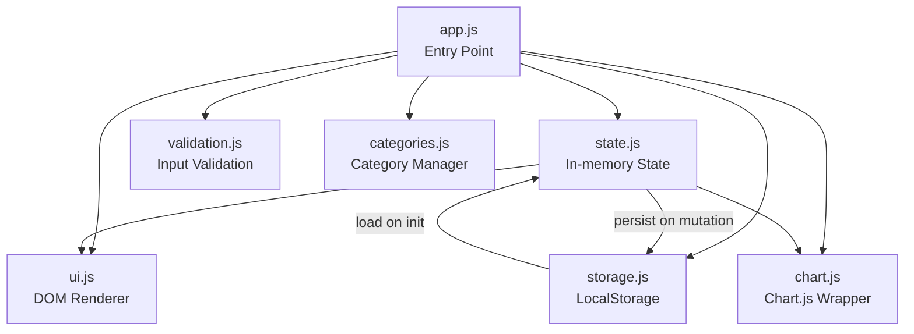

# Design Document: Expense & Budget Visualizer

## Overview

The Expense & Budget Visualizer is a fully client-side, zero-dependency (no build tooling, no backend) single-page application (SPA) built with plain HTML, CSS, and Vanilla JavaScript. Its primary purpose is to let users record personal expense transactions, visualize category-level spending with a Chart.js pie chart, and monitor a running balance — all while persisting data between sessions via the browser's Local Storage API.

The design is structured around a central in-memory state object that is the single source of truth. Every user interaction mutates that state, persists it to Local Storage, and then triggers a lightweight re-render of the affected UI regions. There is no virtual DOM, no reactive framework, and no server round-trip.

**Key design decisions:**

| Decision | Choice | Rationale |
|---|---|---|
| Language/runtime | Vanilla JS (ES2020+) | Matches deployment target (GitHub Pages, no build step) |
| Chart library | Chart.js (CDN) | Required by spec; minimal footprint |
| Persistence | `localStorage` | Browser-native, no backend needed |
| Currency | IDR (Rp) with dot-separated thousands | Per spec requirements |
| Module system | ES Modules (`<script type="module">`) | Allows clean code splitting without a bundler |

---

## Architecture

The application follows a **unidirectional data flow** pattern:

```
User Interaction
      │
      ▼
 Action Handler  ──► Validate
      │
      ▼
 Mutate State (in-memory)
      │
      ▼
 Persist to LocalStorage
      │
      ▼
 Re-render affected UI components
```

### File Structure

```
/
├── index.html          # Shell: imports CSS, mounts root element, loads app.js
├── css/
│   └── style.css       # All styling including dark/light theme variables
└── js/
    ├── app.js          # Entry point: initialises state, wires event listeners
    ├── state.js        # State object + mutation helpers
    ├── storage.js      # LocalStorage read/write/parse wrappers
    ├── ui.js           # All DOM render functions (transaction list, balance, etc.)
    ├── chart.js        # Chart.js wrapper (create, update, destroy)
    ├── validation.js   # Input validation helpers
    ├── categories.js   # Built-in categories + custom category management
    └── utils.js        # Currency formatter, date helpers, ID generator
```

### Component Interaction Diagram



---

## Components and Interfaces

### 1. State Manager (`state.js`)

Maintains the single in-memory state object and exposes pure mutation functions.

```js
// State shape
const state = {
  transactions: Transaction[],
  customCategories: string[],
  spendingLimit: number | null,
  theme: 'light' | 'dark',
  selectedMonth: string | null,  // 'YYYY-MM' format
};

// Public API
export function getState(): AppState
export function addTransaction(tx: Transaction): void
export function deleteTransaction(id: string): void
export function addCustomCategory(name: string): void
export function setSpendingLimit(value: number | null): void
export function setTheme(theme: 'light' | 'dark'): void
export function setSelectedMonth(month: string | null): void
export function loadInitialState(stored: StoredData): void
```

### 2. Storage Manager (`storage.js`)

Wraps all `localStorage` interactions with error handling.

```js
export function loadFromStorage(): StoredData | null
export function saveTransactions(transactions: Transaction[]): boolean
export function saveCustomCategories(categories: string[]): boolean
export function saveSpendingLimit(limit: number | null): boolean
export function saveTheme(theme: string): boolean
// Returns false and emits a storage-error event on failure
```

### 3. UI Renderer (`ui.js`)

Provides idempotent render functions. Each function reads the current state and rebuilds the relevant DOM subtree.

```js
export function renderTransactionList(transactions: Transaction[]): void
export function renderBalance(transactions: Transaction[]): void
export function renderSpendingWarning(total: number, limit: number | null): void
export function renderCategorySelector(categories: string[]): void
export function renderMonthSelector(transactions: Transaction[]): void
export function renderMonthlySummary(transactions: Transaction[], month: string | null): void
export function showFieldError(fieldId: string, message: string): void
export function clearFieldErrors(): void
export function showGlobalError(message: string): void
```

### 4. Chart Manager (`chart.js`)

Wraps Chart.js to abstract creation, update, and no-data states.

```js
export function initChart(canvasId: string): void
export function updateChart(categoryTotals: Record<string, number>): void
// Handles empty-data state internally by showing a text overlay
```

### 5. Validation (`validation.js`)

Pure functions — no side effects, no DOM access.

```js
export function validateTransactionForm(name: string, amount: string, category: string): ValidationResult
export function validateCustomCategory(name: string, existing: string[]): ValidationResult
export function validateSpendingLimit(value: string): ValidationResult

type ValidationResult = { valid: true } | { valid: false; errors: Record<string, string> }
```

### 6. Utilities (`utils.js`)

```js
export function formatIDR(amount: number): string          // → "Rp 1.250.000"
export function generateId(): string                        // → UUID v4-like
export function getLocalDateString(): string               // → "YYYY-MM-DD"
export function getMonthKey(dateStr: string): string       // → "YYYY-MM"
export function getCategoryColors(categories: string[]): string[]  // deterministic color palette
```

---

## Data Models

### Transaction

```ts
interface Transaction {
  id: string;          // UUID, generated at creation time
  name: string;        // 1–100 characters, non-empty
  amount: number;      // Float, 0.01–999_999_999.99
  category: string;    // One of built-in or custom category names
  date: string;        // ISO date string "YYYY-MM-DD" (device local date)
}
```

### Stored Data Shape (LocalStorage)

All data is stored under a single key `expense_visualizer_v1` as a JSON-serialised object:

```ts
interface StoredData {
  transactions: Transaction[];
  customCategories: string[];   // max 50 entries
  spendingLimit: number | null;
  theme: 'light' | 'dark';
}
```

Using a single storage key with versioned prefix (`_v1`) makes future schema migrations straightforward — if the shape changes, the key changes and stale data is cleanly discarded.

### Validation Schema (for storage load)

On load, each `Transaction` is validated against:
- `id`: non-empty string
- `name`: non-empty string
- `amount`: number > 0
- `category`: non-empty string
- `date`: non-empty string

Any record failing validation causes the entire stored dataset to be discarded and replaced with an empty state (defensive, not partial — prevents corrupt partial states).

### Currency Formatting

IDR amounts are displayed with:
- Prefix `Rp ` (with a space)
- Integer only (no decimal places in display)
- Period (`.`) as thousands separator
- Example: `1250000` → `"Rp 1.250.000"`

### Category Color Assignment

Colors are assigned deterministically via a fixed palette of 20 colors. Built-in categories (Food, Transport, Fun) receive the first three colors. Custom categories receive subsequent colors in insertion order. This guarantees that colors remain stable across page reloads.

```js
const PALETTE = [
  '#FF6384', '#36A2EB', '#FFCE56',  // Food, Transport, Fun
  '#4BC0C0', '#9966FF', '#FF9F40',
  // ... up to 20 total
];
```

---

## Correctness Properties

*A property is a characteristic or behavior that should hold true across all valid executions of a system — essentially, a formal statement about what the system should do. Properties serve as the bridge between human-readable specifications and machine-verifiable correctness guarantees.*

The feature contains pure business-logic functions (validation, formatting, filtering, serialization, and threshold computation) that are well-suited to property-based testing. UI rendering, layout, and cross-browser behavior are handled by example-based and visual tests instead (see Testing Strategy).

---

### Property 1: Valid transaction submission always grows the list

*For any* valid transaction input (non-empty name of at most 100 characters, amount in the range [0.01, 999,999,999.99], and a non-empty category), calling `addTransaction` on any existing transaction list should increase the list length by exactly one, and the new transaction should appear at index 0 (newest first).

**Validates: Requirements 1.3, 2.1**

---

### Property 2: Invalid form input is always rejected

*For any* combination of transaction form inputs where at least one field is either empty or the amount is not a number in the range [0.01, 999,999,999.99], `validateTransactionForm` should return an invalid result with a non-empty error message for each offending field, and the transaction list should remain unchanged.

**Validates: Requirements 1.4, 1.5**

---

### Property 3: Successful submission resets the form to its initial state

*For any* valid transaction that is successfully added, the form's item name field and amount field should be empty and the category selector should be reset to "Food" after the operation completes.

**Validates: Requirements 1.6**

---

### Property 4: Transaction list always rendered in newest-first order

*For any* non-empty list of transactions with distinct creation timestamps, `renderTransactionList` should produce DOM entries in descending order by date added, such that for every adjacent pair of rendered entries the entry at position `i` was added no earlier than the entry at position `i+1`.

**Validates: Requirements 2.1**

---

### Property 5: Delete button count equals transaction count

*For any* list of N transactions (including N = 0), `renderTransactionList` should produce exactly N delete buttons in the rendered output.

**Validates: Requirements 2.3**

---

### Property 6: Successful delete removes the transaction; failed write retains it

*For any* transaction list and any transaction `T` in that list:
- If the storage write succeeds, `T` should no longer appear in the transaction list after `deleteTransaction(T.id)`.
- If the storage write fails, `T` should still appear in the transaction list and a global error message should be visible.

**Validates: Requirements 2.4**

---

### Property 7: Balance display equals formatted sum of all amounts

*For any* list of transactions (including the empty list), `renderBalance` should display a string equal to `formatIDR(sum of all transaction amounts)`, where `formatIDR(0)` is `"Rp 0"`.

**Validates: Requirements 3.1, 3.4**

---

### Property 8: Category totals map is accurate and complete

*For any* non-empty list of transactions, the computed `categoryTotals` map should satisfy two invariants:
1. Every key in the map corresponds to a category that appears in at least one transaction.
2. The value for each key equals the sum of `amount` for all transactions with that category.

**Validates: Requirements 4.1**

---

### Property 9: Category color assignment is always unique

*For any* list of 1 to 53 category names (3 built-in + up to 50 custom), `getCategoryColors` should return a list of the same length where all color values are distinct strings.

**Validates: Requirements 4.4, 6.7**

---

### Property 10: Transaction serialization round-trip preserves all fields

*For any* valid list of transactions, serializing the list to a JSON string and then deserializing it back should produce a list that is deeply equal to the original, with every transaction preserving its `id`, `name`, `amount`, `category`, and `date` fields exactly.

**Validates: Requirements 5.2, 5.6**

---

### Property 11: Corrupt or schema-invalid storage data is always discarded safely

*For any* string value stored in localStorage that either fails JSON parsing or contains a transaction object missing a required field (or with a field of the wrong type), `loadFromStorage` should return `null` without throwing any unhandled errors, and the application should initialize to an empty transaction list.

**Validates: Requirements 5.4**

---

### Property 12: Custom category validation correctly accepts and rejects inputs

*For any* string and any existing category list:
- If the string has 1–50 characters, is not whitespace-only, and does not match any existing entry case-insensitively, `validateCustomCategory` should return valid.
- If the string is empty, whitespace-only, a case-insensitive duplicate, or the existing list already contains 50 entries, `validateCustomCategory` should return invalid with a descriptive error message.

**Validates: Requirements 6.1, 6.4, 6.6**

---

### Property 13: Custom category addition is reflected in the category list

*For any* valid custom category name that passes validation, after `addCustomCategory` is called the name should appear in the application's category list, making it available for transaction and chart rendering.

**Validates: Requirements 6.2**

---

### Property 14: Monthly filter returns exactly the transactions for the selected month

*For any* list of transactions and any YYYY-MM month string:
- If the month is non-null, the filtered result should contain exactly the transactions whose `getMonthKey(date)` equals the selected month.
- If the month is null (cleared), the filtered result should be equal to the full unfiltered transaction list.

**Validates: Requirements 7.2, 7.6**

---

### Property 15: Month selector range covers all recorded transaction months

*For any* non-empty list of transactions, the set of months available in the month selector should equal the union of all unique `YYYY-MM` keys derived from transaction dates and the current calendar month.

**Validates: Requirements 7.1**

---

### Property 16: Spending limit validation accepts in-range values and rejects out-of-range values

*For any* numeric string:
- If the value is in the range [0.01, 999,999,999.99] with at most 2 decimal places, `validateSpendingLimit` should return valid.
- If the value is zero, negative, exceeds 999,999,999.99, or is non-numeric, `validateSpendingLimit` should return invalid.

**Validates: Requirements 8.1**

---

### Property 17: Spending limit warning state is correctly classified for all (total, limit) pairs

*For any* non-null spending limit `L > 0` and total spending `T ≥ 0`, `computeWarningState(T, L)` should return:
- `'none'` when `T < 0.9 × L`
- `'near-limit'` when `0.9 × L ≤ T ≤ L`
- `'exceeded'` when `T > L`

The three cases are mutually exclusive and exhaustive over all non-negative `T`.

**Validates: Requirements 8.5, 8.6**

---

### Property 18: IDR currency formatter produces correct output for all amounts

*For any* non-negative integer amount, `formatIDR` should return a string that:
1. Begins with the prefix `"Rp "`.
2. Contains the integer amount with period-separated groups of three digits from the right (e.g., `1250000` → `"Rp 1.250.000"`).
3. Contains no decimal point in the output.

**Validates: Requirements 2.1, 3.1, 7.3**

---

## Error Handling

### Storage Errors

All `localStorage` calls are wrapped in try/catch inside `storage.js`. On failure, the wrapper:
1. Returns `false` (write) or `null` (read).
2. Dispatches a custom `storage-error` DOM event on `window`.
3. `ui.js` listens for `storage-error` and renders a dismissible error banner at the top of the page.

The in-memory state is **never** rolled back on a storage write failure — the UI remains usable even if persistence fails.

### Corrupt Storage Data

On app init, `loadFromStorage()` attempts `JSON.parse`. If parsing throws, or if schema validation finds any invalid transaction record, the entire dataset is discarded and replaced with `{ transactions: [], customCategories: [], spendingLimit: null, theme: 'light' }`. The user sees empty state, not a crash.

A single invalid transaction in an otherwise valid array is enough to discard the whole array. This prevents a partially-loaded corrupt state that would be hard to reason about.

### Validation Errors

Client-side only. `validateTransactionForm` and `validateCustomCategory` return a `ValidationResult` object — they never mutate the DOM directly. The event handlers in `app.js` call `ui.showFieldError(fieldId, message)` for each error in the result. On a successful submission, `ui.clearFieldErrors()` is called first to remove any stale error messages.

### Chart.js Errors

`chart.js` catches exceptions from Chart.js operations and logs them to `console.error`. If the canvas element is missing, `initChart` exits silently. The empty-data state is handled by rendering a `<p>` overlay with "No data to display" text on top of the canvas — Chart.js itself is not invoked with an empty dataset to avoid library-internal warnings.

### Unhandled Promise Rejections

No async operations are used; all data flow is synchronous. There are no network requests, no `fetch` calls, and no dynamic imports at runtime. This eliminates the class of unhandled promise rejection errors entirely.

---

## Testing Strategy

### Overview

The application uses a **dual testing approach**: property-based tests for universal business logic properties, and example-based/integration tests for specific scenarios and UI behavior.

Property-based testing library: **[fast-check](https://fast-check.io/)** (JavaScript, framework-agnostic, well-maintained, runs in Node.js without a browser).

Test runner: **[Vitest](https://vitest.dev/)** (ESM-native, fast, compatible with fast-check, no configuration overhead for Vanilla JS modules).

### Unit & Property Tests (pure logic, no DOM)

These tests run in Node.js and cover all pure-function modules:

| Module | Test type | Covers |
|---|---|---|
| `utils.js` (`formatIDR`) | **Property** | Property 18 |
| `utils.js` (`getLocalDateString`, `getMonthKey`) | Example | Date utility correctness |
| `utils.js` (`getCategoryColors`) | **Property** | Property 9 |
| `validation.js` (`validateTransactionForm`) | **Property** | Properties 2 |
| `validation.js` (`validateCustomCategory`) | **Property** | Property 12 |
| `validation.js` (`validateSpendingLimit`) | **Property** | Property 16 |
| `state.js` (`addTransaction`) | **Property** | Properties 1, 3 |
| `state.js` (`deleteTransaction`) | **Property** | Property 6 |
| `state.js` (`computeWarningState`) | **Property** | Property 17 |
| `state.js` (category totals derivation) | **Property** | Property 8 |
| `storage.js` (serialize/deserialize) | **Property** | Properties 10, 11 |
| `storage.js` (corrupt data handling) | **Property** | Property 11 |
| Monthly filter logic | **Property** | Properties 14, 15 |
| `state.js` (`addCustomCategory`) | **Property** | Property 13 |

**Property test configuration:**
- Minimum **100 iterations** per property test (fast-check default).
- Each test is tagged with a comment: `// Feature: expense-budget-visualizer, Property N: <property text>`
- fast-check arbitraries used: `fc.string()`, `fc.float()`, `fc.integer()`, `fc.array()`, `fc.record()`, `fc.constantFrom()`, custom `arbitraryTransaction()`.

### DOM / Integration Tests

These tests run with [jsdom](https://github.com/jsdom/jsdom) (via Vitest's `jsdom` environment) and exercise the rendering functions with the real DOM:

| What is tested | Test type | Covers |
|---|---|---|
| Transaction list render ordering | **Property** | Property 4 |
| Delete button count matches list length | **Property** | Property 5 |
| Balance display output | **Property** | Property 7 |
| Form reset after add | **Property** | Property 3 (DOM layer) |
| Empty list shows no-transactions message | Edge case | Req 2.6 |
| Empty dataset shows "Rp 0" | Edge case | Req 3.4 |
| Month selector range | **Property** | Property 15 |
| Storage write failure shows error banner | Edge case | Req 2.4, 5.5 |
| Theme toggle applies CSS class | Example | Req 9.2 |
| Theme persists to localStorage | Example | Req 9.3 |
| App init loads theme before render | Smoke | Req 9.4 |

### Visual / Accessibility Tests (manual)

These require a browser and cannot be automated in CI without additional tooling:

- **Responsive layout** at 320px, 768px, 1024px, 1440px (Req 10.1)
- **Cross-browser** on Chrome, Firefox, Edge, Safari (Req 10.2)
- **Touch interaction** on mobile device (Req 10.3)
- **Contrast ratio** of dark mode theme (Req 9.6) — can be augmented with `axe-core`
- **Chart.js CDN** dependency check (Req 10.5) — visual inspection of `index.html`

### Test File Layout

```
tests/
├── unit/
│   ├── utils.test.js
│   ├── validation.test.js
│   ├── state.test.js
│   ├── storage.test.js
│   └── categories.test.js
├── dom/
│   ├── ui.test.js
│   ├── chart.test.js
│   └── app.integration.test.js
└── setup.js          # jsdom environment config, fast-check global seed
```

### Running Tests

```bash
# Single run (CI / no watch mode)
npx vitest --run

# With coverage
npx vitest --run --coverage
```

No build step is required; Vitest handles ES Modules natively.
